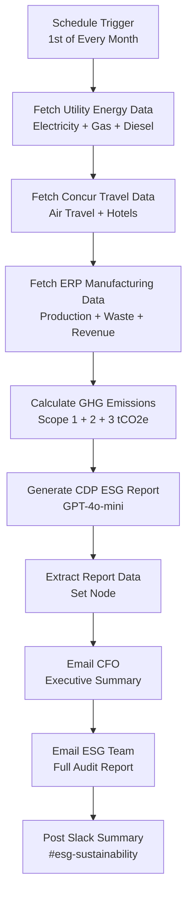

# 🌿 ESG Carbon Footprint Audit Agent

> 🔗 **[Live n8n Workflow](https://aravind5.app.n8n.cloud/workflow/miStgpv1YYBJ26Y1)**

An n8n-powered sustainability automation agent that runs on the 1st of every month, pulls energy, travel, and manufacturing data from enterprise systems, calculates Scope 1, 2, and 3 emissions following GHG Protocol methodology, and delivers a CDP-style carbon audit report to your CFO and ESG team — with zero manual data collection.

## What It Does

The agent runs monthly and automatically:

1. **Fetches utility energy data** — electricity kWh, natural gas MMBtu, diesel, and water consumption
2. **Fetches Concur travel expenses** — total air travel km and hotel nights from expense reports
3. **Fetches ERP manufacturing data** — production electricity, waste tonnes, and revenue figures
4. **Calculates Scope 1/2/3 emissions** — GHG Protocol-compliant tCO2e with IPCC emission factors
5. **Generates CDP-style report** — GPT-4o-mini produces executive summary, reduction opportunities, and disclosure paragraph
6. **Emails CFO** — executive-level carbon summary with benchmark comparison
7. **Emails ESG team** — full audit with CDP disclosure, offset recommendations, and reduction roadmap
8. **Posts Slack summary** — #esg-sustainability channel gets key monthly metrics digest

## n8n Workflow Architecture



## Setup Instructions

### 1. Clone or fork this Space

```bash
git clone https://huggingface.co/spaces/Darkweb007/esg-audit-agent
cd esg-audit-agent
```

### 2. Install dependencies

```bash
pip install -r requirements.txt
```

### 3. Configure Secrets

In your Hugging Face Space settings, add the following secret:

| Secret Name | Description | Required |
|---|---|---|
| `OPENAI_API_KEY` | OpenAI API key for GPT-4o-mini | Yes (for Tab 2) |

Navigate to: **Space Settings → Variables and Secrets → New Secret**

### 4. Run locally

```bash
python app.py
```

### 5. Deploy to HF Spaces

Push to your Space repository — it will build and deploy automatically.

## n8n Integration

To connect this UI to a real n8n workflow:

1. Open the live n8n workflow linked above
2. Set your utility provider API URL and token in the energy HTTP node
3. Set your Concur OAuth token in the travel data HTTP node
4. Set your ERP API URL and credentials in the manufacturing HTTP node
5. Add Gmail OAuth2 and Slack OAuth2 credentials
6. Set CFO and ESG team email addresses in the Gmail nodes
7. Activate — the workflow fires automatically on the 1st of each month

## Supported Systems

| System | Action |
|---|---|
| Utility API | Monthly electricity, gas, diesel, and water consumption |
| SAP Concur | Business travel — air km and hotel nights from expense reports |
| ERP (SAP / Oracle) | Manufacturing energy, waste output, and revenue data |
| Gmail | CFO executive report + ESG team full audit |
| Slack | Monthly carbon digest to #esg-sustainability |
| OpenAI GPT-4o-mini | CDP disclosure, reduction opportunities, and offset strategy |

## Emissions Scope Coverage

| Scope | Source | IPCC Factor |
|---|---|---|
| Scope 1 | Natural gas combustion | 0.0533 tCO2e/MMBtu |
| Scope 1 | Diesel fleet vehicles | 0.00268 tCO2e/liter |
| Scope 2 | Purchased electricity | 0.000233 tCO2e/kWh |
| Scope 3 | Business air travel | 0.000255 tCO2e/km |
| Scope 3 | Hotel stays | 0.031 tCO2e/night |
| Scope 3 | Waste to landfill | 0.467 tCO2e/tonne |

## License

MIT
